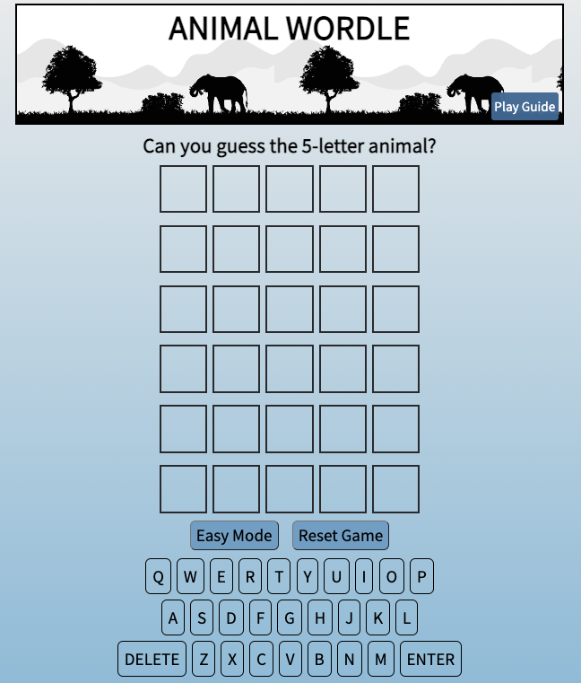
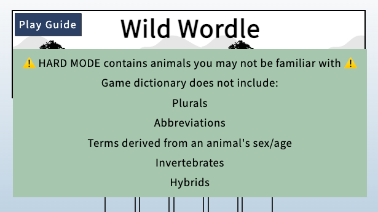

# 🐯 Animal Wordle 🐴
## [Play Here!](https://animal-wordle.netlify.app/)
***

Animal Wordle is a Wordle clone that only includes 5-letter animals! The game begins with an empty board and a secret winning animal. The goal is to guess the animal in as few attempts as possible. To guess; use the on-screen keyboard or type a 5-letter animal and press enter. The color of your guess will change to reveal how close you are to the winning word. If a letter is in the winning word and placed correctly, it turns green. If a letter is in the winning word but placed incorrectly, it turns yellow. If a letter isn't in the winning word it turns gray. Use that feedback to make your next guess!

The game has two difficulty levels: easy and hard. The default setting is easy. The easy dictionary contains commonly known animals. The hard dictionary contains every 5-letter vertebrate I could find.

*** 
### Additional Game Guidelines:

 The game will not accept words that are not in the animal dictionary. The 'Play Guide' outlines the dictionary parameters.

  

*** 
### Planning Materials:

[Google Doc](https://docs.google.com/document/d/1nvmqQsvxhi2VuerHIz5UJXqBhCKOcDKmVDcbwoH9SsQ/edit?usp=sharing)

[Whimsical Layout](https://whimsical.com/animal-wordle-UWaS1nJQAhosM2B1yB4AGA)

***
### Technologies Used:

* JavaScript
* HTML
* CSS
* Git

***
### Attributions:

* Animal Dictionary
  * _Animal_ by the Smithsonian Institution (2005)
  * _The Field Guide to the Birds of New Zealand_ by Barrie Heather and Hugh Robertson (2015)
  * _The Sibley Field Guide to Birds of Eastern North America_ by David Allen Sibley (2003)
  * _Peterson Field Guides Western Birds_ by Roger Tory Peterson (1990)
  * _Pocket Birds of Britain and Europe_ by Jonathan Elphick and John Woodward (2012)
  

* Font
  * [Google Fonts - Source Sans Pro](https://fonts.google.com/specimen/Source+Sans+Pro?preview.text=animal%20wordle&preview.text_type=custom)
  

* Guide for Hidden Menu
  * [W3Schools - CSS Dropdown](https://www.w3schools.com/howto/howto_css_dropdown.asp)
  

* Title Image
  * [African Animal Silhouettes Vectors by Vecteezy](https://www.vecteezy.com/free-vector/african-animal-silhouettes)
  

* Favicon
  * [Cat Icon by Icons8](https://icons8.com/icon/101706/cat)
  

* Animation
  * [Animate.css - ShakeX and Pulse](https://animate.style/)
  

* Inspiration
  * [New York Times Wordle](https://www.nytimes.com/games/wordle/index.html)
  * [Josh Wardle](https://en.wikipedia.org/wiki/Josh_Wardle)

***
### Icebox Items:

* Dark Mode
* Exciting win feedback
* Better mobile responsive design
* Blurb or link to winning animal natural history information to make it more educational
* Track wins/statistics
* Birdle: bird-only dictionary
* Animation during guess assessment
***
### 💙 Dedications 💙

**My mom** - brags about winning the NYT Wordle every day but can't win this one.

**Allan Strong** - the reason I can name any birds at all.
